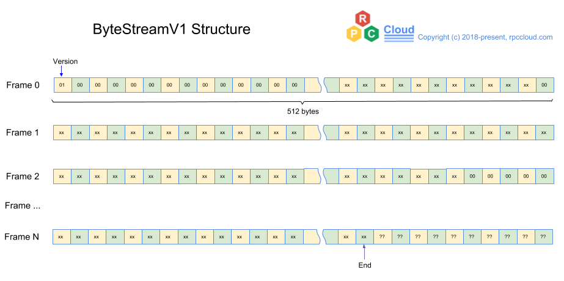
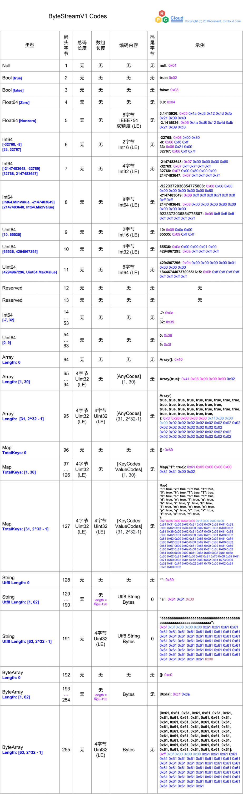

# RPCStream v1.0

### 目的 （Purpose）
定义一种二进制字节流格式，用于高速RPC传输

### 概念和约定 （Concepts Definition & Conventions）
* 数组索引约定  
本定义中，所有数组索引从0开始
* 字节帧 （RPCStream Frame） 
512个字节的集合，字节帧是字节流内存分配的基本单元。
* LE （Little Endian） 
即低位字节排放在内存的低地址端，高位字节排放在内存的高地址端。
* Int64.MinValue    
Int64.MinValue = -9223372036854775808  
* Int64.MaxValue  
Int64.MaxValue = 9223372036854775807
* Uint64.MaxValue  
Uint64.MaxValue = 18446744073709551615

### 字节流 （RPCStream）
字节流由版本和内容两部分组成。版本占一个字节（0-255），其余为内容部分。 
结构如下图所示:

### 内容编码:

